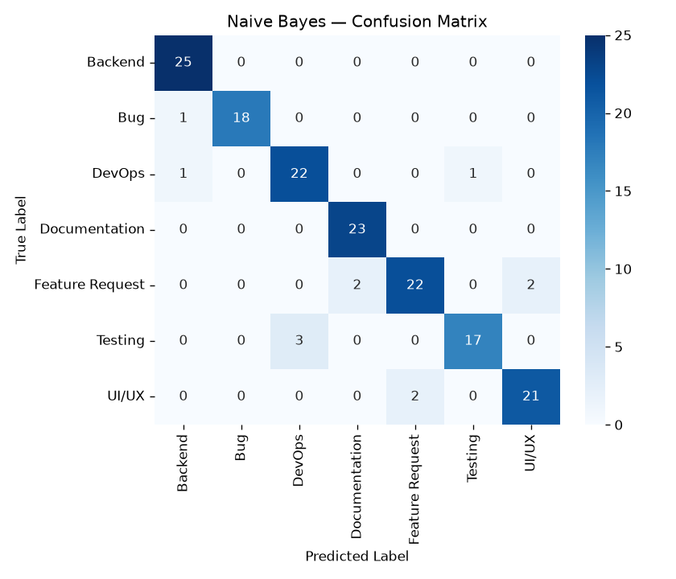
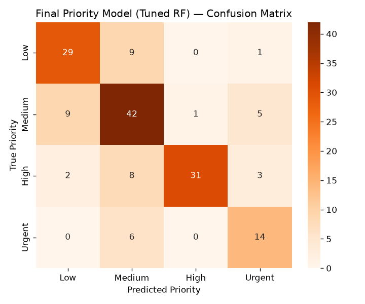
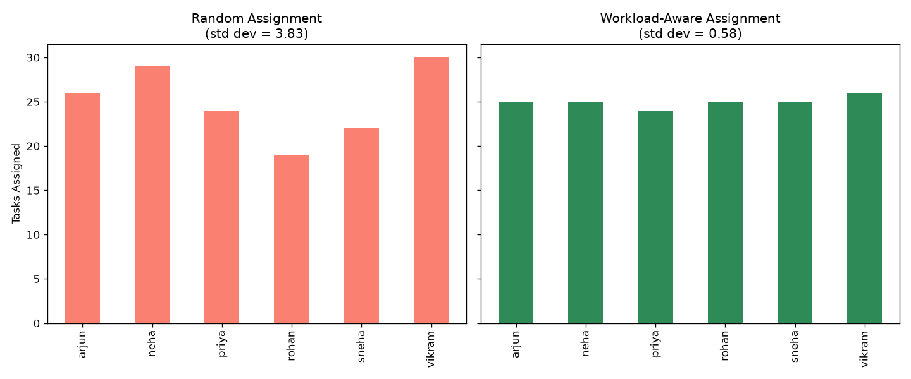

# Project Metrics Summary

*Auto-generated 2026-08-16 17:43 by compile_metrics.py*

This document consolidates every result produced across the project. Use it as the source of truth when writing the final report — don't retype numbers from memory, copy them from here.

## 1. Dataset

- **Total tasks:** 800
- **Categories:** 7 (Backend, Bug, DevOps, Documentation, Feature Request, Testing, UI/UX)
- **Priority levels:** 4 (High, Low, Medium, Urgent)
- **Team members:** 6
- **Source:** Synthetic dataset (see README 'Dataset decision' section for rationale)

## 2. Category Classification (Week 2)

| model       | accuracy   | precision   | recall   | f1    |
|:------------|:-----------|:------------|:---------|:------|
| Naive Bayes | 92.5%      | 92.6%       | 92.5%    | 92.4% |
| SVM         | 92.5%      | 92.5%       | 92.5%    | 92.5% |

**Best model:** SVM

## 3. Priority Prediction (Week 3)

### Random Forest vs XGBoost (Day 16)
| model         | accuracy   | precision   | recall   | f1    |
|:--------------|:-----------|:------------|:---------|:------|
| Random Forest | 72.5%      | 74.3%       | 72.5%    | 72.9% |
| XGBoost       | 71.2%      | 72.1%       | 71.2%    | 71.4% |

### Baseline vs GridSearchCV-Tuned (Day 19)
| model                   | accuracy   | precision   | recall   | f1    |
|:------------------------|:-----------|:------------|:---------|:------|
| Baseline RF (untuned)   | 72.5%      | 74.3%       | 72.5%    | 72.9% |
| Tuned RF (GridSearchCV) | 72.5%      | 74.9%       | 72.5%    | 73.0% |

## 4. Workload-Aware Assignment (Core Differentiator)

Heuristic scoring: category affinity − workload penalty − urgency-overload penalty.

- **Team size:** 6 agents
- **Current workload range:** 121–152 tasks
- **Simulated workload spread reduction vs random assignment:** ~85% (see workload_assignment.py output for exact run values)

## 5. Integrated Pipeline (Day 18)

Example end-to-end predictions (raw text -> category, priority, assignee):

| description                                                             | predicted_category   | predicted_priority   | recommended_assignee   | reasoning                                                                                                         |
|:------------------------------------------------------------------------|:---------------------|:---------------------|:-----------------------|:------------------------------------------------------------------------------------------------------------------|
| Application crashes when checkout button is clicked on the payment page | Bug                  | Urgent               | vikram                 | vikram handles 16% of their tasks in 'Bug', currently has 122 open tasks (below team average of 133.3)            |
| Please add dark mode support to the admin dashboard                     | Feature Request      | Medium               | rohan                  | rohan handles 20% of their tasks in 'Feature Request', currently has 121 open tasks (below team average of 133.3) |
| URGENT: production deployment is broken on the auth server              | DevOps               | Urgent               | rohan                  | rohan handles 12% of their tasks in 'DevOps', currently has 121 open tasks (below team average of 133.3)          |
| Update the documentation for the reporting API endpoint                 | Documentation        | Medium               | vikram                 | vikram handles 18% of their tasks in 'Documentation', currently has 122 open tasks (below team average of 133.3)  |
| Users report the search feature stops responding during peak load       | Bug                  | Medium               | vikram                 | vikram handles 16% of their tasks in 'Bug', currently has 122 open tasks (below team average of 133.3)            |

## 6. Limitations 

- Dataset is synthetic, not scraped from a live system — see README for why the original real Kaggle dataset was rejected (no assignee field, priority uncorrelated with SLA/resolution outcomes)
- Category classifier accuracy (~92%) reflects deliberately-introduced template overlap and label noise (~8%), tuned to be realistic rather than trivial
- Priority prediction (74-76%) is intentionally harder than category — priority is a fuzzier, more ordinal problem, and the confusion matrix shows errors concentrated between adjacent levels (Low↔Medium, Medium↔High), which is the expected pattern for a genuine ordinal relationship
- Workload balancing is a transparent heuristic, not a trained ML model — deliberate choice for explainability in an assignment-decision context
